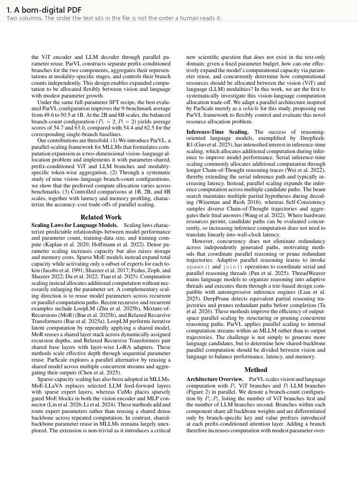

<h1 align="center">DocStruct</h1>

<p align="center">
  <strong>Local, deterministic, structure-aware PDF chunking for RAG.</strong>
</p>

<p align="center">
  
</p>

<p align="center">
  <sub>A real page through the real pipeline — every box above is a
  <code>run_pipeline()</code> result, not a mock-up.
  Regenerate with <code>python scripts/make_readme_gif.py &lt;pdf&gt; --page 1</code>.</sub>
</p>

<p align="center">
  <a href="#benchmark">Benchmark</a> ·
  <a href="paper/">Paper</a> ·
  <a href="datasets/">Datasets</a> ·
  <a href="#install">Install</a> ·
  <a href="docs/API.md">API</a> ·
  <a href="#quickstart">Quickstart</a> ·
  <a href="#how-it-works">How it works</a> ·
  <a href="#reproducing-the-benchmark">Reproduce</a>
</p>

<p align="center">
  
  
  
</p>

---

DocStruct turns born-digital PDFs into retrieval-ready chunks that respect
document structure. Section hierarchy, tables and figure captions stay intact
instead of being shredded by fixed-size windows.

It runs two **independent** layout detectors — a rules-based geometry pass over
pdfplumber primitives, and an optional YOLOv8/DocLayNet vision model — reconciles
them with a deterministic fusion algorithm, and emits chunks annotated with their
section path.

Three properties define the project:

- **No LLM calls in the pipeline.** Same PDF in → same chunks out. Auditable.
- **Fully local.** No API, no internet at inference time. Runs air-gapped.
- **Structured output.** Bounding boxes, per-source confidence, reading order and
  section hierarchy — not free-form text.

## Why

Naive RAG chunking splits on token counts, which destroys exactly the structure
that makes a document navigable: tables split mid-row, captions detach from
figures, headers orphan from their bodies. DocStruct detects layout first and
chunks along real document boundaries, then exposes section metadata so retrieval
can be filtered (`where={"h1": "3. Methodology"}`).

Crucially, a structural boundary only *ends* a chunk once it holds enough text to
be worth retrieving (`MIN_CHUNK_TOKENS`). Without that floor, a page of prose
interleaved with three figures becomes four unretrievable stubs — which is what
the earliest versions of this project did, and fixing it was worth more than every
other change combined.

| Compared with | DocStruct's difference |
|---|---|
| LangChain recursive splitter | respects structure; carries section-path metadata |
| Unstructured.io / LlamaParse | fully local, free, deterministic, section-filtered retrieval |
| pymupdf4llm | higher MRR / NDCG / Recall / Hit@1 on *less* retrieved context |

## Benchmark

The embedder and both retrievers are **held constant across every tool** — only the
chunker varies — so every table below measures chunking and nothing else.

### The headline, and the catch: the relevance rule decides the winner

OHR-Bench: 95 born-digital documents, **3,558 human-authored questions**, seven
chunkers. All three columns are scored on **identical chunks** — only the rule that
decides "is this chunk relevant?" changes.

| Tool | `page` | `span` | `region` | ctx words |
|---|---|---|---|---|
| **docstruct** | 0.600 (6th) | **0.706 (1st)** | **0.666 (1st)** | 2194 |
| docstruct_geo | 0.470 (7th) | 0.705 (2nd) | 0.657 (2nd) | 2328 |
| pymupdf4llm | 0.668 | 0.699 (3rd) | 0.604 (3rd) | 2424 |
| unstructured | **0.795 (1st)** | 0.654 | 0.601 | **561** |
| langchain | 0.756 | 0.641 | 0.603 | 638 |
| llamaindex | 0.729 | 0.648 | 0.589 | 1430 |
| llamaindex_semantic | 0.652 | 0.654 | 0.575 | 4698 |

**We are 1st of 7 under two rules and 6th of 7 under the third.** That is not noise
and it is not a bug — no relevance rule is size-neutral. `span` rewards large chunks,
`page` rewards small ones, and unstructured wins `page` with the smallest chunks in
the field. A chunking leaderboard that reports one rule has reported a ranking *and*
a size preference, tangled together.

We could find no prior chunking evaluation that varies the rule, so we publish all
three. Read [`memory/relevance-modes.md`](memory/relevance-modes.md) before quoting
any row.

Is our `region` win just a lucky threshold? No — swept 0.1→1.0, a DocStruct variant
is **1st at all ten thresholds** ([`reports/ohr_region_threshold_sweep.json`](reports/ohr_region_threshold_sweep.json)).
Worth stating plainly: 0.7 is where our margin happens to peak.

### Section boundaries, with no retriever involved

Do the chunk boundaries land where the *document's own* boundaries land? Scored
against section boundaries the publishers wrote in JATS XML for **134 PubMed Central
papers** — gold that predates this project and was written for an unrelated purpose.
Pk and WindowDiff are **error** rates; lower is better.

| Tool | WindowDiff | Pk | Chunks | Docs |
|---|---|---|---|---|
| **docstruct_geo** | **0.4226** | **0.3418** | 26.8 | 134 |
| pymupdf4llm | 0.4800 | 0.4490 | 17.7 | 134 |
| **docstruct** | 0.4818 | 0.3531 | 37.5 | 134 |
| llamaindex_semantic | 0.5337 | 0.5128 | 29.1 | 134 |
| llamaindex | 0.6952 | 0.5979 | 42.7 | 134 |
| langchain | 0.8787 | 0.6200 | 85.6 | 134 |
| unstructured | 0.8933 | 0.6025 | 106.9 | **99** |

No embedder, no relevance rule, nothing of ours in the gold. Two caveats we'd rather
state than have found: WindowDiff punishes over-segmentation, so read it beside Pk or
not at all; and unstructured's row covers 99 of 134 documents because it hard-failed
on 35 (26%).

### Internal corpus (ablations only)

92 born-digital arXiv PDFs, 558 **LLM-generated** Q&A pairs. The gold is synthetic, so
by our own rule this carries no headline claim — it is here because ablations only need
our own configurations to be comparable to each other.

| Rank | Tool | MRR | 95% CI | NDCG@5 | Recall@5 | Hit@1 | Avg words/chunk | Context words |
|---|---|---|---|---|---|---|---|---|
| 1 | **docstruct** | **0.8203** | [0.794, 0.846] | **0.832** | **0.9427** | **0.7401** | 339.0 | 2404 |
| 2 | docstruct (geometry-only) | 0.7760 | [0.747, 0.804] | 0.7988 | 0.9283 | 0.6756 | 335.0 | 2570 |
| 3 | pymupdf4llm | 0.7646 | [0.736, 0.793] | 0.7897 | 0.9194 | 0.6577 | 443.1 | 2662 |
| 4 | langchain | 0.7009 | [0.669, 0.734] | 0.7284 | 0.8477 | 0.5986 | 106.3 | 505 |
| 5 | unstructured | 0.6948 | [0.662, 0.727] | 0.7271 | 0.8561 | 0.5920 | 84.5 | 549 |

DocStruct's lead over every external tool is **statistically significant** on MRR,
NDCG and Hit@1 (paired bootstrap, p from 0.0008 to 0.0001). The CIs and a full
paired-difference table are generated into every report — a point estimate over a
few hundred questions cannot by itself say whether a gap is real, and comparing
overlapping CIs is the standard way to get that wrong.

**Does the vision model earn its place?** The `geometry-only` row is the same
chunker with the vision model switched off. It scores 0.7760 against the hybrid's
0.8203 — **+0.0443 MRR, p = 0.0026, significant**. (An earlier run on flawed gold
put this gap at +0.009 and not significant; fixing a two-column extraction bug in
the *reference* text — see `notes.md` — is what surfaced the real effect. The
ablation existed precisely to be able to ask this question, and to catch it being
answered wrong.)

**Context words** is the text handed to the generator per query, summed over the
retrieved top-5. It is in the table on purpose: a containment relevance metric
always rewards bigger chunks, so "make chunks bigger" is an unbounded way to buy
MRR — including for us. DocStruct leads every quality metric *and* returns less
context per query than pymupdf4llm.

What DocStruct does **not** win: raw extraction coverage. langchain preserves 100%
of the document's words (it splits raw text and drops nothing); DocStruct keeps
~82% and has the highest duplication (2.06×, from inline headers and separately
emitted table chunks). DocStruct wins *retrieval*, not raw preservation — the
report's extraction-fidelity table states this without spin.

Full runs with per-document breakdowns, paired-significance tables, extraction
fidelity and the config snapshot that produced each one:
[`reports/`](reports/). The write-up is [`paper/main.tex`](paper/main.tex); the
corpora and their checksums are [`datasets/`](datasets/). How the numbers got there,
and what was tried and abandoned: [`notes.md`](notes.md).

**Known defects, found and recorded rather than fixed quietly:** a layout block that
spans both columns can have its text extracted across the gutter, interleaving the two
columns into an unreadable section heading (2 of 76 chunks on the demo document); and
full-width elements above a two-column body — a paper title, an author block — are
ordered after the columns rather than before. Both are in
[`to-do.md`](to-do.md).

## Install

```bash
pip install docstruct-rag
```

The distribution is **`docstruct-rag`** — `docstruct` was already taken on PyPI by an
unrelated package. The import name is unchanged:

```python
import docstruct
doc = docstruct.parse("paper.pdf")
```

Core install pulls two dependencies (`pdfplumber`, `numpy`) and needs no network at
parse time. Everything else is an extra:

```bash
pip install "docstruct-rag[model]"        # YOLOv8/DocLayNet vision detector
pip install "docstruct-rag[langchain]"    # doc.to_langchain()
pip install "docstruct-rag[llamaindex]"   # doc.to_llamaindex()
pip install "docstruct-rag[all]"          # everything incl. benchmark tooling
```

Full API reference: [`docs/API.md`](docs/API.md).

## Quickstart

### Python

```python
import docstruct
from pathlib import Path

doc = docstruct.parse("paper.pdf")                       # geometry-only, offline
doc = docstruct.parse(Path("paper.pdf"))                 # str or Path
doc = docstruct.parse("paper.pdf", weights="weights/yolov8m-doclaynet.pt")
doc = docstruct.parse("locked.pdf", password="secret")   # encrypted PDFs

doc.text                      # whole document in reading order
doc.markdown                  # headings, tables and captions preserved
doc.to_markdown("paper.md")   # ...and write it to a file
doc.pages()                   # {page_num: text}
doc.sections()                # ["1. Introduction", "2. Method > 2.1 Setup", ...]
doc.to_json("chunks.json")

for chunk in doc.chunks:      # retrieval-ready units
    print(chunk.chunk_type, chunk.section_path, chunk.content[:80])

doc.chunks_of_type("table")   # table / text / figure_caption / abstract
doc.tables                    # [(grid, page_num, section_path), ...]
doc.figures                   # [(page_num, bbox), ...]
```

Failures raise a typed hierarchy so you never catch pdfminer internals:

```python
from docstruct import DocStructError, InvalidPDFError, EncryptedPDFError

try:
    doc = docstruct.parse("maybe.pdf")
except EncryptedPDFError:
    ...                       # wrong/no password
except InvalidPDFError:
    ...                       # corrupt, truncated, or not a PDF
except DocStructError:
    ...                       # any DocStruct failure

# Scanned/image-only PDFs parse but flag themselves — DocStruct is born-digital
# only; run a deterministic OCR pass (e.g. ocrmypdf) first.
if doc.diagnostics.get("likely_scanned"):
    ...
```

`parse(..., cache_dir=".cache")` caches detector output and populated blocks by
PDF content hash, so re-parsing an unchanged file is close to free. For raw fused
blocks and fusion diagnostics, use `docstruct.pipeline.run_pipeline`.

### Retrieval

```python
from docstruct.indexing.vector_store import VectorStore
from docstruct.query.retriever import Retriever

store = VectorStore(persist_dir=".chroma")
store.index(doc.chunks, doc_id="paper")

retriever = Retriever(store, hybrid=True,                       # dense + BM25 via RRF
                      rerank_model="cross-encoder/ms-marco-MiniLM-L-6-v2")
for r in retriever.retrieve("ablation results", top_k=5,
                            where={"h1": "4. Experiments"}):     # section-scoped
    print(r.citation())        # [Corpus preparation] (page 2, score 0.48)
```

Both retrieval modes honour `where`. Reranking is off unless `rerank_model` is
set — it loads a second model at query time, which the local-by-default design
otherwise avoids.

### CLI

```bash
docstruct run paper.pdf                                  # geometry-only
docstruct run paper.pdf --weights weights/yolov8m-doclaynet.pt
docstruct run paper.pdf --format md   --out paper.md     # convert to Markdown
docstruct run paper.pdf --format text --out paper.txt    # ...or plain text
docstruct run paper.pdf --format json --out chunks.json  # ...or chunk JSON

docstruct index a.pdf b.pdf --db .chroma
docstruct query "what baseline did they compare against?" --db .chroma --top-k 5
docstruct query "results" --db .chroma --h1 "4. Experiments"    # section-filtered
docstruct query "BM25-XR-7 ablation" --db .chroma --hybrid      # dense + BM25

docstruct visualize paper.pdf --out annotated.pdf         # inspect detections
```

## How it works

```
PDF
 ├─ geometry/detector.py   pdfplumber rules ─┐  (blind to the model)
 ├─ model/detector.py      YOLOv8/DocLayNet ─┤  (optional, blind to geometry)
 │                                           ▼
 │                         fusion/matcher    greedy IoU match + priority NMS
 │                         fusion/arbiter    confirmed vs disputed (label)
 │                         fusion/fusion     → List[Block] + ConfidenceBreakdown
 ├─ reading_order.py       columns + top→bottom; caption → figure/table
 ├─ extraction/            block text + table grids (font-scaled word spacing)
 ├─ chunking/              header levels by font rank → section-aware chunks,
 │                         with a minimum-size floor on structural boundaries
 ├─ indexing/              sentence-transformers → ChromaDB
 └─ query/                 top-k chunks + section-path citations
```

Both detectors run fully independently and never see each other's output. All
reconciliation happens in `fusion/`. That independence is what makes the
confidence scores meaningful — agreement between two uncorrelated observers,
rather than one model's softmax renamed.

### Fusion in one table

| Case | Condition | Final confidence |
|---|---|---|
| Confirmed | both detect, same label, IoU ≥ 0.35 | `0.85 + 0.10·model_conf + 0.05·IoU` |
| Disputed | both detect, different label, IoU ≥ 0.35 | `winner_conf × 0.85` |
| Unilateral | one detector only | source-scaled and bounded (see `config.py`) |

### Determinism and coordinates

Every stage is deterministic. Coordinates are **top-left** throughout (`y0` = top,
y increasing downward), matching pdfplumber and PyMuPDF, so geometry, model (after
a pixel→point transform), extraction and visualization all share one space.

Chunk sizes are counted in whitespace words, not tokenizer tokens — deliberately.
A real tokenizer would tie chunk boundaries to a model version and break "same PDF
in → same chunks out".

All thresholds live in `config.py`, each with a comment naming the measurement
that chose it. Values inherited from the v0 prototype are flagged `# unvalidated`.

## Evaluation

Two independent layers in `docstruct.eval`:

- **Detection** — per-class precision/recall/F1 and confidence-ranked **mAP@0.5**
  against ground-truth boxes. Build ground truth with
  `docstruct export-annotations` + `tools/annotate.html`.
- **Retrieval** — **MRR / NDCG@k / Recall@k / Hit@1**, plus context cost and
  bootstrap significance, over LLM-generated Q&A, against the other chunkers.
- **Extraction fidelity** — coverage and duplication against the raw PDF text.
  No gold, no LLM; the document is its own reference. This is the one cross-tool
  signal that measures extraction rather than retrieval.

The gold is `(question, verbatim answer_span)` generated from each PDF's **raw
text** — never from DocStruct chunks, which would inflate DocStruct's own score.
Every span is validated as a real substring of the source. A retrieved chunk from
any tool counts as relevant if it contains the span, so every chunker is scored by
the identical rule.

### Reproducing the benchmark

```bash
python scripts/fetch_dataset_v2.py                       # fetch the corpus

python -m docstruct.cli gen-qa data/raw-pdfs/*.pdf \
  --out data/qa/benchmark_qa.json --per-doc 10 \
  --provider ollama --model gpt-oss:120b

python -m docstruct.cli benchmark \
  --pdfs-dir data/raw-pdfs --qa data/qa/benchmark_qa.json \
  --weights weights/yolov8m-doclaynet.pt --cache-dir .bench_cache \
  --report-md reports/run.md --report-json reports/run.json
```

Both commands resume where they left off. `gen-qa` needs an API key for an
OpenAI-compatible endpoint (`OLLAMA_API_KEY` or `GROQ_API_KEY` in `.env`) — the
**only** place this project talks to an LLM. The default tool set is
docstruct + pymupdf4llm + langchain + unstructured; `docling` is available via
`--tools` but excluded by default (10× slower, no change to the ranking). Add
`docstruct_geo` / `docstruct_model` to `--tools` for the single-detector
ablation.

Extraction fidelity on its own, chunking only:
`python scripts/coverage_report.py`.

To measure a single chunking change without re-running the unaffected baselines:

```bash
python scripts/ablate.py --name min300 --set MIN_CHUNK_TOKENS=300
```

## Scope and limitations

- **In scope:** born-digital, prose-structured PDFs — papers, reports, manuals,
  books.
- **Out of scope:** scanned documents (no OCR, by design), slide decks,
  forms/invoices.
- Borderless tables are caught by the model, not by geometry (`find_tables` is
  ruled-line based) — a concrete motivation for the hybrid design.
- Geometry-only hierarchy is font-driven, so it can conflate title / author /
  section headers; the model resolves these semantically.
- Rotated and margin text is filtered out of the reading flow.
- The benchmark corpus is **arXiv-heavy** born-digital prose (92 papers). A
  seven-domain fetcher (`scripts/fetch_dataset_v2.py`) exists to broaden it —
  legal, financial, medical, manuals — but those documents are not yet in the
  scored set; read every number above as measured on two-column academic papers.
- The gold Q&A is LLM-generated. It measures the tool-vs-tool delta well but is
  weaker than human-judged relevance as an absolute claim.

## Project layout

```
docstruct/          the library (geometry, model, fusion, chunking, eval, cli)
tests/              pytest suite, 220 tests
scripts/            corpus fetching and single-tool ablation runner
tools/annotate.html browser UI for correcting detection ground truth
reports/            benchmark reports, each with its full config snapshot
memory/             durable project knowledge — architecture, decisions, results
notes.md            chronological engineering log
implementation_plan.md   standing plan-vs-code audit
```

## Development

```bash
python -m venv .venv && .venv/Scripts/activate      # Windows
pip install -e ".[all]"
pytest -q                                            # 220 tests, ~4 min
```

Tests that need optional extras, real PDFs or an LLM self-skip when those are
absent, so the suite stays green on a bare core install.

Contributions are welcome, with one standing rule: **any change to chunking,
reading order or extraction must be measured** with `scripts/ablate.py` against
the numbers in [`memory/results.md`](memory/results.md) before it is claimed as an
improvement. Several elegant changes in this project's history measured worse and
were turned off; that is recorded in [`memory/decisions.md`](memory/decisions.md)
so nobody re-proposes them blind.

## License

MIT — see [LICENSE](LICENSE).
